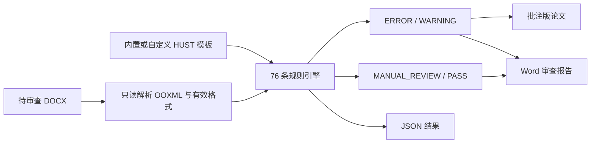

# 华中科技大学硕士学位论文 Word 格式审查器

`hust-thesis-format-review` 是一个基于 Agent Skills 目录结构的论文格式审查技能。它以仓库内附带的华中科技大学理工科硕士学位论文参考模板为证据，对 `.docx` 论文进行只读解析和规则审查，并生成带原生 Word 批注的论文副本、结构化 Word 审查报告以及可选的 JSON 明细。

该技能不会默认修改原论文。模板中的文字只作为格式依据，不会被当作对智能体的操作指令。

## 它能做什么

- 解析 DOCX/OOXML 结构、样式继承、主题字体、段落格式、域、书签、关系和特殊对象。
- 按 76 条已确认规则检查页面、页眉页脚、字体、标题、摘要、目录、图表、公式、脚注和参考文献等内容。
- 将结果区分为 `ERROR`、`WARNING`、`MANUAL_REVIEW` 和 `PASS`，避免把必须人工判断的内容误报为自动通过。
- 仅在能够可靠定位到正文段落时写入 Word 原生批注，避免把页眉、页脚、节级或视觉问题错误地挂到正文。
- 保留原论文，另行输出批注版论文、15 节 Word 审查报告和 JSON 结果。



## 安装

仓库当前为私有仓库。执行以下命令前，请确保 Git 已通过有权访问本仓库的 GitHub 账号完成认证；使用 SSH 的用户也可以把 HTTPS 地址替换为 `git@github.com:juan-12138/hust-thesis-format-review.git`。

安装命令的作用是把完整技能目录克隆到相应智能体的用户级 Skills 目录。由于各平台的技能发现目录不同，不存在一条能够自动适配所有智能体的安装命令；下面分别列出已确认支持 Agent Skills 的主流平台，并提供通用安装方式。安装完成后，请新建会话；部分客户端需要重启或重新加载技能。

### Codex

Windows PowerShell：

```powershell
New-Item -ItemType Directory -Force "$env:USERPROFILE\.codex\skills" | Out-Null
git clone https://github.com/juan-12138/hust-thesis-format-review.git "$env:USERPROFILE\.codex\skills\hust-thesis-format-review"
```

macOS / Linux：

```bash
mkdir -p "${CODEX_HOME:-$HOME/.codex}/skills"
git clone https://github.com/juan-12138/hust-thesis-format-review.git "${CODEX_HOME:-$HOME/.codex}/skills/hust-thesis-format-review"
```

安装后可在 Codex 中使用 `$hust-thesis-format-review` 调用。

### Claude Code

Windows PowerShell：

```powershell
New-Item -ItemType Directory -Force "$env:USERPROFILE\.claude\skills" | Out-Null
git clone https://github.com/juan-12138/hust-thesis-format-review.git "$env:USERPROFILE\.claude\skills\hust-thesis-format-review"
```

macOS / Linux：

```bash
mkdir -p "$HOME/.claude/skills"
git clone https://github.com/juan-12138/hust-thesis-format-review.git "$HOME/.claude/skills/hust-thesis-format-review"
```

Claude Code 会从用户级 `~/.claude/skills/` 发现技能，可通过 `/hust-thesis-format-review` 调用。参见 [Claude Code Skills 官方文档](https://code.claude.com/docs/en/skills)。

### WorkBuddy / CodeBuddy Code

Windows PowerShell：

```powershell
New-Item -ItemType Directory -Force "$env:USERPROFILE\.codebuddy\skills" | Out-Null
git clone https://github.com/juan-12138/hust-thesis-format-review.git "$env:USERPROFILE\.codebuddy\skills\hust-thesis-format-review"
```

macOS / Linux：

```bash
mkdir -p "$HOME/.codebuddy/skills"
git clone https://github.com/juan-12138/hust-thesis-format-review.git "$HOME/.codebuddy/skills/hust-thesis-format-review"
```

WorkBuddy/CodeBuddy Code 会从用户级 `~/.codebuddy/skills/` 读取技能。可运行 `/skills` 检查是否已加载；WorkBuddy 桌面版也支持在“技能 → 添加技能 → 上传技能”中导入本地技能包。参见 [CodeBuddy Code Skills 官方文档](https://www.workbuddy.cn/docs/cli/skills)和 [WorkBuddy 技能导入说明](https://www.workbuddy.cn/docs/workbuddy/From-Beginner-to-Expert-Guide/Function-Description/Skills-Market)。

### Cursor

Windows PowerShell：

```powershell
New-Item -ItemType Directory -Force "$env:USERPROFILE\.cursor\skills" | Out-Null
git clone https://github.com/juan-12138/hust-thesis-format-review.git "$env:USERPROFILE\.cursor\skills\hust-thesis-format-review"
```

macOS / Linux：

```bash
mkdir -p "$HOME/.cursor/skills"
git clone https://github.com/juan-12138/hust-thesis-format-review.git "$HOME/.cursor/skills/hust-thesis-format-review"
```

Cursor 会自动发现用户级 `~/.cursor/skills/` 中的技能，也兼容部分其他智能体的 Skills 目录。参见 [Cursor Skills 官方文档](https://prod.cursor.com/docs/skills)。

### OpenCode

Windows PowerShell：

```powershell
New-Item -ItemType Directory -Force "$env:USERPROFILE\.config\opencode\skills" | Out-Null
git clone https://github.com/juan-12138/hust-thesis-format-review.git "$env:USERPROFILE\.config\opencode\skills\hust-thesis-format-review"
```

macOS / Linux：

```bash
mkdir -p "$HOME/.config/opencode/skills"
git clone https://github.com/juan-12138/hust-thesis-format-review.git "$HOME/.config/opencode/skills/hust-thesis-format-review"
```

OpenCode 会从全局 `~/.config/opencode/skills/` 发现技能，并兼容 `~/.claude/skills/` 与 `~/.agents/skills/`。参见 [OpenCode Agent Skills 官方文档](https://opencode.ai/docs/skills/)。

### Gemini CLI

已安装 Gemini CLI 时，可直接运行：

```bash
gemini skills install https://github.com/juan-12138/hust-thesis-format-review
```

如果私有仓库无法通过上述命令完成认证，可在 Git 已登录的环境中克隆到用户级目录：

```bash
mkdir -p "$HOME/.gemini/skills"
git clone https://github.com/juan-12138/hust-thesis-format-review.git "$HOME/.gemini/skills/hust-thesis-format-review"
```

安装后可运行 `/skills reload` 重新加载。Gemini CLI 也支持通用的 `~/.agents/skills/` 目录。参见 [Gemini CLI Agent Skills 官方文档](https://geminicli.com/docs/cli/using-agent-skills/)。

### 其他兼容 Agent Skills 的智能体

```bash
git clone https://github.com/juan-12138/hust-thesis-format-review.git "<该智能体的用户级 Skills 目录>/hust-thesis-format-review"
```

不同智能体的技能目录和重载方式并不统一。只要目标智能体支持以 `SKILL.md` 为入口、允许读取同目录的 `scripts/`、`rules/` 和 `references/`，即可按其官方目录约定安装。若目标智能体不支持 Agent Skills，可将本仓库作为普通 Python 工具使用。

## 运行依赖

- Python 3.10 或更高版本。
- Python 环境能够导入 `lxml`。
- 输入文件为有效的 `.docx`。
- 智能体能够读取本地文件并执行 Python；写入输出文件时需要相应目录权限。

检查 Python 环境：

```bash
python -c "import lxml; print(lxml.__version__)"
```

## 使用示例

把待审查论文交给智能体，并说明：

```text
使用 hust-thesis-format-review 审查这篇华中科技大学硕士学位论文，保留原文件，生成批注版论文、Word 审查报告和 JSON 结果。
```

也可以直接运行一键审查脚本：

```bash
python scripts/review_thesis.py "待审查论文.docx" \
  --output "待审查论文_格式审查批注版.docx" \
  --report-output "待审查论文_格式审查报告.docx" \
  --manifest "待审查论文_格式审查结果.json"
```

只输出 JSON 审查结果：

```bash
python scripts/review_rules.py "待审查论文.docx" --output "格式审查.json"
```

## 审查规则

规则模型共包含 76 条规则，按以下范围组织：

| 规则范围 | 数量 | 主要检查内容 |
| --- | ---: | --- |
| 文档完整性与页面设置 | 6 | DOCX 包结构、关键部件、A4 纸张、页边距、页面方向、分节设置 |
| 封面、前置页与摘要 | 10 | 中英文题名、作者信息、声明页、中英文摘要、关键词数量与分隔符 |
| 目录、标题、正文与字体 | 14 | 自动目录、目录层级、章标题、节标题、正文中西文字体、字号、行距、对齐与缩进 |
| 页眉、页脚与页码 | 4 | 页眉文字及格式、分节关联、页码域、页码位置 |
| 图、表与公式 | 13 | 图题与表题、编号、正文引用、三线表、跨页表、表注、OMML 公式和公式编号 |
| 脚注与参考文献 | 15 | 脚注格式及编号、参考文献连续编号、作者数量、末尾标点、类型结构和姓名写法 |
| 论文结构与附录 | 5 | 章节构成、本章小结、附录以及成果列表 |
| 语言、特殊对象与视觉复核 | 9 | 缩写、数字与单位、域、书签、交叉引用、修订、内容控件、裁切碰撞和可读性 |

完整中文规则见 [`rules/hust_master_thesis_rules_zh.yaml`](rules/hust_master_thesis_rules_zh.yaml)。程序使用稳定字段的 [`rules/hust_master_thesis_rules.yaml`](rules/hust_master_thesis_rules.yaml)，并通过 [`rules/hust_master_thesis_rules.json`](rules/hust_master_thesis_rules.json) 运行。

### 规则依据优先级

1. 模板正文中的明确文字要求。
2. 模板中能够明确识别为正确格式的示例。
3. Word 样式和 OOXML 结构。
4. 已记录的推断。

若不同来源冲突，规则会保留冲突证据，并按更高优先级来源执行。带有“建议”“一般”“尽量”等措辞的要求通常按警告处理。

### 自动化级别

- `AUTOMATIC`：可以从 DOCX/OOXML 稳定判断。
- `SEMI_AUTOMATIC`：能够定位候选问题，但仍需结合上下文确认。
- `MANUAL_REVIEW`：必须依赖最终渲染、语义、事实或学术内容判断。

### 结果级别

- `ERROR`：证据足以确认违反强制要求，或 DOCX 结构无效。
- `WARNING`：建议性要求、疑似问题、边界情况或规则来源冲突。
- `MANUAL_REVIEW`：需要人工核对页面效果、内容语义、来源真实性或学术质量。
- `PASS`：对已检查的适用对象未发现问题；`evaluated_count: 0` 仅表示没有发现适用对象。

## 可配置内容

### 规则与容差

可在规则模型中调整：

- 期望值，例如字体、字号、页边距、行距、作者数量和编号格式。
- 数值容差和允许的例外。
- 严重程度与自动化级别。
- 适用范围、检查方式、依据和批注模板。

面向人工维护时先修改中文规则文件；英文 YAML 是程序接口，JSON 是运行时镜像。三者需要保持一致，不能只修改 JSON 造成规则漂移。

### 参考模板

默认模板位于：

```text
references/华中科技大学硕士学位论文参考模板.docx
```

智能体可以使用用户提供的新模板替换审查依据，但应保留原模板与新模板的来源、版本和冲突记录。

### 命令行参数

| 参数 | 用途 |
| --- | --- |
| `--rules` | 指定兼容的运行时 JSON 规则文件 |
| `--output` | 指定批注版论文路径 |
| `--report-output` | 指定 Word 审查报告路径 |
| `--manifest` | 保存完整审查、批注和报告映射 JSON |
| `--author` | 设置 Word 批注作者，默认为“HUST格式审查” |
| `--initials` | 设置批注作者缩写，默认为 `HUST` |
| `--template-name` | 设置报告中显示的模板名称 |

## 输出结果

### 1. 批注版论文

默认命名为 `<原文件名>_格式审查批注版.docx`。源论文保持不变；只有 `ERROR` 和 `WARNING` 且能可靠定位到 `word/document.xml` 正文段落的问题会写入原生 Word 批注。

### 2. Word 审查报告

默认命名为 `<原文件名>_格式审查报告.docx`，固定包含 15 个部分：审查概况、严重问题、页面版式、字体、段落、标题、图、表、公式、目录、页眉页脚与页码、脚注与参考文献及附录、无法批注定位的问题、人工复核项和审查统计。

### 3. JSON 结果

保存全部 `RuleResult`、Finding、严重程度统计、适用对象计数、证据、建议、批注状态、跳过原因和输出文件映射，便于二次处理或接入其他系统。

## 能力边界

- 复杂浮动对象的真实居中、裁切、重叠、空白页和平衡分页必须结合 Word 或 LibreOffice 的最终渲染复核。
- 中英文摘要语义对应、图表科学性、术语正确性、参考文献真实性和来源准确性不能仅凭 OOXML 自动确认。
- 没有适用对象时的 `PASS` 不表示该类内容已经被证明合规。
- 默认只审查并生成副本；只有用户明确要求修改时，智能体才应修改论文内容或格式。
